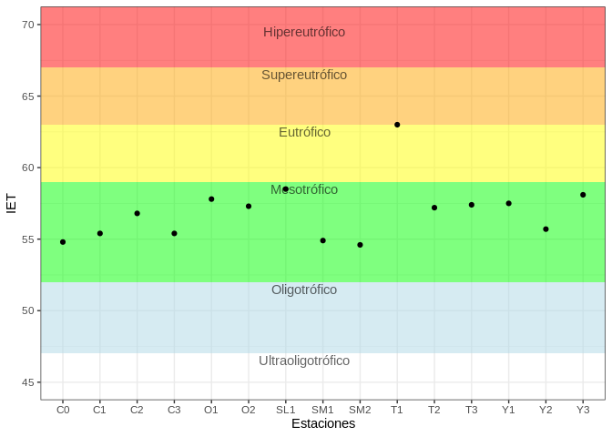

-   [siabox](#siabox)
    -   [Instalación](#instalación)
    -   [Modo de uso](#modo-de-uso)
    -   [Para desearrolladores](#para-desearrolladores)

<!-- README.md is generated from README.Rmd.

Pendientes:

Cambiar documentación de sia_datos_muestra_parametros: id_dato en vez de id.
Lo mismo para datos_sia

Please edit that file -->

# siabox

<!-- badges: start -->
<!-- badges: end -->

Se trata de un paquete pensado para trabajar con datos del SIA,
especialmente en realizar gráficos, tablas e informes, usando datos
incluidos en el mismo, o descargados desde
[iSIA](dinama-shiny:3838/sia_apps/iSIA/).

Incluye varias tablas (data.frames) con datos tomados directamente del
SIA, que sirven para correr ejemplos. En principio, si estos ejemplos
funcionan en los datos contenidos en el paquete, también lo harán con
datos nuevos del SIA y, por lo tanto, servirán para confeccionar
informes automatizados.

Para usar el paquete se recomienda el uso de
[tidyverse](https://www.tidyverse.org/) en general (algunos esos
paquetes son necesarios, de hecho). Además, los ejemplos mostrados aquí
y en las distintas viñetas, usan funciones de `tidyverse`
extensivamente.

En este documento se muestra lo básico del paquete. Se recomienda
visitar las viñetas para profundizar:

``` r
vignette('graficos', package = 'siabox')
vignette('datos-incluidos', package = 'siabox')
```

## Instalación

El paquete se puede instalar desde GitHub:

``` r
# install.packages("devtools")
devtools::install_github("jumanbar/siabox")
```

## Modo de uso

La idea es que el paquete trabaje en conjunto con la aplicación
[iSIA](dinama-shiny:3838/sia_apps/iSIA/). En la práctica, el flujo puede
tomar dos caminos:

1.  Se puede trabajar con **datos extraidos** de la aplicación
    [iSiA](dinama-shiny:3838/sia_apps/iSIA/) en el momento.

2.  Se pueden usar datos que ya están **en el paquete** para analizar o
    hacer pruebas. El código así generado luego se puede utilizar para
    datos descargados desde [iSIA](dinama-shiny:3838/sia_apps/iSIA/).

Uno de los objetivos más importantes es que las herramientas del paquete
sirvan para elaborar **informes automatizados**, mediante Rmarkdown. Hay
un ejemplo (en construcción) con datos del programa Laguna Merín para
tomar de referencia:

``` r
# Tres formatos de salda posibles: PDF, HTML y DOC
demo('informe-laguna-merin-pdf',  'siabox')
demo('informe-laguna-merin-html', 'siabox')
demo('informe-laguna-merin-doc',  'siabox')
```

### Con extracciones de iSIA

El siguiente es un ejemplo que usa datos extraídos de iSIA (formato
‘largo’):

-   Programa: Laguna Merín
-   Año de las muestras: 2019
-   Matriz: Aguas superficiales
-   Muestras: superficie
-   Parámetros: ClorofilaA, NAmoniacal, NO2, NO3, NT, OD, pH, PO4, PT,
    SatO2 y T

Afortunadamente, no es necesario descargar estos datos en particular, ya
que se encuentran en el paquete mismo. Vamos a crear una data.frame
llamada `d`, usando la función `filtrar_datos`, que simula los filtros
de iSIA:

``` r
library(siabox)
d <- filtrar_datos(datos_sia, 
                   id_programa = 10L,
                   id_matriz = 6L,
                   rango_fechas = c('2019-01-01', '2019-12-31'),
                   tipo_punto_id = 1L, # 1 = Superficie; 2 = Fondo
                   id_parametro = c(2098, 2101, 2099, 2097, 2102, 2032,
                                    2018, 2090, 2021, 2017))
```

Se puede, por ejemplo, crear un gráfico de IET como el siguiente:

``` r
d %>% iet_tabla() %>% g_iet()
```



En este caso se están usando las funciones `iet_tabla` y `g_iet` del
paquete. Aquí no se muestra, pero el paquete incluye una tercer función
relacionada: `iet`.

Hay otros cálculos frecuentes que ya están incluidos en el paquete. Uno
de ellos es el del Amoníaco Libre. Para una tabla de datos como la
mencionada, la función `amoniaco_libre_add` permite agregar al parámetro
NH3L (siempre y cuando hayan datos de T, pH y NH4):

``` r
# Agregar NH3L:
d <- amoniaco_libre_add(d)

# Se pueden ver algunos valores aquí:
d %>%
  filter(id_parametro == 2091) %>%
  select(codigo_pto, fecha_muestra, param, valor)
#> # A tibble: 39 x 4
#>    codigo_pto fecha_muestra param  valor
#>    <fct>      <date>        <chr>  <dbl>
#>  1 C0         2019-06-04    NH3L  0.0687
#>  2 C1         2019-06-04    NH3L  0.0921
#>  3 C2         2019-06-04    NH3L  0.283 
#>  4 O2         2019-06-04    NH3L  0.187 
#>  5 SL1        2019-06-03    NH3L  0.135 
#>  6 SM1        2019-06-03    NH3L  0.0510
#>  7 SM2        2019-06-03    NH3L  0.0376
#>  8 T1         2019-06-05    NH3L  0.902 
#>  9 T2         2019-06-05    NH3L  0.133 
#> 10 T3         2019-06-06    NH3L  0.278 
#> # … with 29 more rows

# Gráficos de nutrientes:
g_mes_pto_all(d, id_parametro = c(2098, 2101, 2099, 2097, 2102, 2091), ncol = 3)
```


> Para ver detalles del cálculo en sí, ver `?amoniaco_libre`.

> Las etiquetas del gráfico se pueden mejorar aún con la función
> `t_eti_add` (ver viñeta ‘gráficos’).

El paquete cuenta con otras funciones listas para crear gráficos de
informes: ver `?g_mes_pto` o `?g_long` para más ejemplos, pero se
recomienda especialmente leer la viñeta ‘graficos’:

``` r
vignette('graficos', package = 'siabox')
```

### Con datos incluidos en el paquete

El paquete viene con dos conjuntos de datos extraídos del SIA: ver
`?datos_sia` o `?datos_sia_sed` para acceder a la documentación de estas
tablas, con datos de aguas superficiales y de sedimentos,
respectivamente.

Dichas tablas tienen todos los datos encontrados en SIA, a la fecha en
que fueron extraidos, para todos los programas y parámetros disponibles.
El objetivo de estas tablas es el de hacer pruebas, ejemplos y código
que luego se puede aplicar a datos más actualizados (extraídos con
iSIA).

Dado que se trata de tablas de gran tamaño (`datos_sia` tiene 223112
filas y 39 columnas), es conveniente filtrarlos según el subconjunto de
interés. Para esto es que el paquete cuenta con la función
`filtrar_datos`, que replica las funcionalidades de filtro de iSIA, como
ya se mencionó.

El siguiente es un ejemplo datos similares al ejemplo usado
anteriormente (la diferencia es el rango de fechas):

``` r
d <- filtrar_datos(datos_sia, 
                   id_programa = 10L, 
                   id_matriz = 6L,
                   rango_fechas = c('2015-01-01', '2019-12-31'),
                   tipo_punto_id = 1L,
                   id_parametro = c(2098, 2101, 2099, 2097, 2102, 2032,
                                    2018, 2090, 2021, 2017))

g_long(d, 2098, anio = 2019)
```


> La idea de replicar la funcionalidad de iSIA es de poder hacer pruebas
> antes de descargar datos, incluso pensando en la automatización de
> reportes.

Para profundizar sobre los contenidos y usos de los datos incluidos en
el paquete, se recomienda visitar la viñeta `datos-incluidos`:

``` r
vignette('datos-incluidos', package = 'siabox')
```

### Cálculos útiles

El paquete cuenta con algunas funciones relativamente simples que son de
ayuda para realizar cálculos frecuentes: `iet`, `iet_tabla`,
`amoniaco_libre`, `amoniaco_libre_add`, `media_geom`, `raiz` y
`tsummary` .

#### Índice de estado trófico (IET)

La función `iet` calcula el IET para valores de Fósforo Total (en
microgramos por litro):

``` r
iet(c(25, 50, 75, 250))
#> [1] 50.65856 54.25856 56.36443 62.61750
PT <- seq(0, 300, by=5)
plot(PT, iet(PT), ylab = "IET", xlab = "PT (ug/L)", pch = 20)
```


#### Tabla con categorías de IET

Agrupa valores de IET por estación de monitoreo (`codigo_pto`),
asignando categorías a los valores según su IET (Oligotrófico,
Mesotrófico, etc…). Usa la media geométrica para agrupar los valores
encontrados.

``` r
d <- filtrar_datos(datos_sia, 
                   id_programa = 10L, 
                   id_matriz = 6L,
                   rango_fechas = c('2019-01-01', '2019-12-31'),
                   tipo_punto_id = 1L,
                   id_parametro = 2098)
iet_tabla(d)
#> # A tibble: 15 x 3
#>    codigo_pto   IET categ      
#>    <fct>      <dbl> <chr>      
#>  1 C0          54.8 Mesotrófico
#>  2 C1          55.4 Mesotrófico
#>  3 C2          56.8 Mesotrófico
#>  4 C3          55.4 Mesotrófico
#>  5 O1          57.8 Mesotrófico
#>  6 O2          57.3 Mesotrófico
#>  7 SL1         58.5 Mesotrófico
#>  8 SM1         54.9 Mesotrófico
#>  9 SM2         54.6 Mesotrófico
#> 10 T1          63   Eutrófico  
#> 11 T2          57.2 Mesotrófico
#> 12 T3          57.4 Mesotrófico
#> 13 Y1          57.5 Mesotrófico
#> 14 Y2          55.7 Mesotrófico
#> 15 Y3          58.1 Mesotrófico
```

La función puede, además, agrupar por otras columnas, como por ejemplo,
mes, año, etc…

``` r
d <- filtrar_datos(datos_sia, 
                   id_programa = 10L, 
                   id_matriz = 6L,
                   rango_fechas = c('2017-01-01', '2019-12-31'),
                   tipo_punto_id = 1L,
                   id_parametro = 2098)
```

IET x Estación x Mes:

``` r
iet_tabla(d, mes)
#> # A tibble: 58 x 4
#>    codigo_pto   mes   IET categ      
#>    <fct>      <int> <dbl> <chr>      
#>  1 C0             3  56.4 Mesotrófico
#>  2 C0             6  55.6 Mesotrófico
#>  3 C0             9  55.8 Mesotrófico
#>  4 C0            12  56.1 Mesotrófico
#>  5 C1             3  58.6 Mesotrófico
#>  6 C1             6  56.8 Mesotrófico
#>  7 C1             9  57   Mesotrófico
#>  8 C1            12  57.9 Mesotrófico
#>  9 C2             3  59.6 Eutrófico  
#> 10 C2             6  58.2 Mesotrófico
#> # … with 48 more rows
```

IET x Estación x Año x Mes:

``` r
iet_tabla(d, anio, mes)
#> # A tibble: 136 x 5
#>    codigo_pto  anio   mes   IET categ      
#>    <fct>      <int> <int> <dbl> <chr>      
#>  1 C0          2017     3  57.1 Mesotrófico
#>  2 C0          2017     6  56.6 Mesotrófico
#>  3 C0          2017     9  55.6 Mesotrófico
#>  4 C0          2017    12  56.6 Mesotrófico
#>  5 C0          2018     3  55.7 Mesotrófico
#>  6 C0          2018     6  55.8 Mesotrófico
#>  7 C0          2018    12  57.9 Mesotrófico
#>  8 C0          2019     6  54.6 Mesotrófico
#>  9 C0          2019     9  56   Mesotrófico
#> 10 C0          2019    12  53.9 Mesotrófico
#> # … with 126 more rows
```

Esta función se puede combinar con herramientas de dplyr fácilmente (en
el ejemplo también se usa `tsummary`, de siabox):

``` r
iet_tabla(d, anio) %>%
  group_by(anio, categ) %>%
  tsummary(IET)
#> # A tibble: 7 x 9
#> # Groups:   anio [3]
#>    anio categ              n   Min `1er Cu` Media Mediana `3er Cu`   Max
#>   <int> <chr>          <int> <dbl>    <dbl> <dbl>   <dbl>    <dbl> <dbl>
#> 1  2017 Eutrófico          3  59.5     59.7  60.4    59.9     60.8  61.7
#> 2  2017 Mesotrófico       11  56.5     57.5  57.9    58       58.4  58.6
#> 3  2018 Eutrófico          4  59.3     59.4  59.6    59.6     59.8  60  
#> 4  2018 Mesotrófico       10  56.4     57.7  58.0    58.3     58.7  58.8
#> 5  2018 Supereutrófico     1  64       64    64      64       64    64  
#> 6  2019 Eutrófico          1  63       63    63      63       63    63  
#> 7  2019 Mesotrófico       14  54.6     55.4  56.5    57       57.5  58.5
```

#### Estadísticas resumen

La función **`tsummary`**, usada en el ejemplo anterior, es una ayuda
para obtener cálculos similares a los de `summary`, que permite agrupar
según distintas variables (i.e.: columnas). Hay que tener en cuenta que
sólamente puede hacer cálculos con variables numéricas.

Uso de tsummary para resumir datos de Clorofila-A en el programa Río
Cuareim:

``` r
datos_sia %>% 
  filter(param == 'Clo_a', id_programa == 5) %>% 
  tsummary(valor)
#> # A tibble: 1 x 7
#>       n   Min `1er Cu` Media Mediana `3er Cu`   Max
#>   <int> <dbl>    <dbl> <dbl>   <dbl>    <dbl> <dbl>
#> 1   240  0.05      0.5  1.91     0.9      1.6  23.7
```

Lo mismo, pero agrupando por estación de monitoreo:

``` r
datos_sia %>% 
  filter(id_parametro == 2000, id_programa == 5) %>% 
  group_by(codigo_pto) %>% 
  tsummary(valor)
#> # A tibble: 8 x 8
#>   codigo_pto     n   Min `1er Cu` Media Mediana `3er Cu`   Max
#>   <chr>      <int> <dbl>    <dbl> <dbl>   <dbl>    <dbl> <dbl>
#> 1 RC10          34  0.05    0.750  2.06    1.38     2.35 10.7 
#> 2 RC20          43  0.05    0.650  1.39    1        1.48  8.9 
#> 3 RC35          48  0.05    0.4    1.92    0.7      1.58 21   
#> 4 RC3C70         1  0.05    0.05   0.05    0.05     0.05  0.05
#> 5 RC40          48  0.05    0.4    2.73    0.7      2.42 23.7 
#> 6 RC50          34  0.05    0.525  1.12    0.7      1.45  3.9 
#> 7 RC60          31  0.05    0.45   2.14    1        1.9  16.3 
#> 8 RCYU80         1  0.2     0.2    0.2     0.2      0.2   0.2
```

> Notas: el primer ejemplo y el segundo difieren en 2 aspectos:
>
> -   el agrupamiento (con la función `group_by`, de
>     [dplyr](https://dplyr.tidyverse.org/)) y
>
> -   se filtra parámetro por nombre y luego por **id** (id\_parametro).
>
> Parámetros y otras categorías importantes (programas, estaciones,
> unidades, …), tienen varias formas de ser identificados, siendo **id**
> la única **permanente**.

Otra función incluida en el paquete es `raiz`, que calcula la raíz
enésima de un valor dado, incluso cuando ese valor es negativo (en cuyo
caso, n debe ser impar). La misma es usada, a su vez, por `media_geom`
(la [Media
Geométrica](https://es.wikipedia.org/wiki/Media_geom%C3%A9trica)).

Cálculo de la raíz enésima:

``` r
tibble(x = c(4, -4, 4, -4), n = c(2, 2, 3, 3)) %>%
  mutate(raiz(x, n), x ^ (1 / n), abs(x) ^ (1 / n))
#> # A tibble: 4 x 5
#>       x     n `raiz(x, n)` `x^(1/n)` `abs(x)^(1/n)`
#>   <dbl> <dbl>        <dbl>     <dbl>          <dbl>
#> 1     4     2         2         2              2   
#> 2    -4     2       NaN       NaN              2   
#> 3     4     3         1.59      1.59           1.59
#> 4    -4     3        -1.59    NaN              1.59
```

Cálculo de una media geométrica, usando valores aleatorios:

``` r
x <- rnorm(100, 8)
mean(x)
#> [1] 7.987352
media_geom(x)
#> [1] 7.942157
```

## Para desearrolladores

> (Sección que, al menos en parte, escribo para refrescar mi propia
> memoria.)

Este paquete se creó siguiendo de forma aproximada los consejos del
libro [R Packages](https://r-pkgs.org/index.html) de Hadley Wickham. El
libro entero es importante para entender el desarrollo de paquetes (o la
documentación original de CRAN), pero para referencia rápida de quien ya
sabe la teoría y sólo tiene que recordar el flujo, ir directamente al
capítulo 5: [Fundamental development
workflows](https://r-pkgs.org/workflows101.html).

Algunas notas:

-   Al usar funciones de paquetes externos, evitar `require` o
    `library`; usar en cambio los operadores `::` o `:::`. Ejemplo:
    `dplyr::filter`. Eso evita afectar el ambiente de trabajo del
    usuario final (o sea, no hay que cargar todo el paquete `siabox`
    para usar una única función; `tsummary` es un ejemplo de función
    útil en sí misma). En este paquete las excepciones son `ggplot2` y
    `%>%`, ya que de otra forma el código se vuelve muy engorroso
    rápidamente.

-   Lo mismo para trabajar con los conjuntos de datos del paquete…
    Sucede que las funciones del paquete tienen asociado un NAMESPACE,
    así que cuando se llama a una función de `siabox` desde el cuerpo de
    otra función de `siabox`, se sobreentiende que el NAMESPACE del
    paquete está incluido en el camino de búsqueda de funciones. Pero
    esto no ocurre con los datasets (supongo que los creadores de R
    nunca lo consideraron necesario). Por esta razón, siempre que se,
    por ejemplo, `sia_parametro` dentro de una función de `siabox`, hay
    que escribir `siabox::sia_parametro`.

-   La función `devtools::load_all()` (Ctrl+Shift+L) sirve para “cargar”
    el paquete en la sesión, incluyendo funciones, viñetas, y otros
    códigos. Conviene correrlo cada vez que cambiamos alguna función y
    queremos probarla, por ejemplo.

-   La función `devtools::document()` (Ctrl+Shift+D) sirve para
    actualizar los archivos de documentación.
