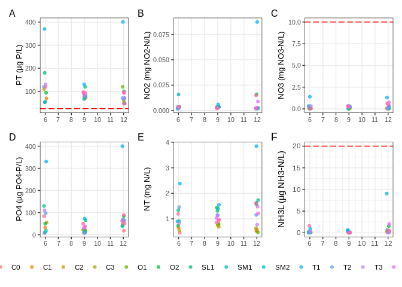
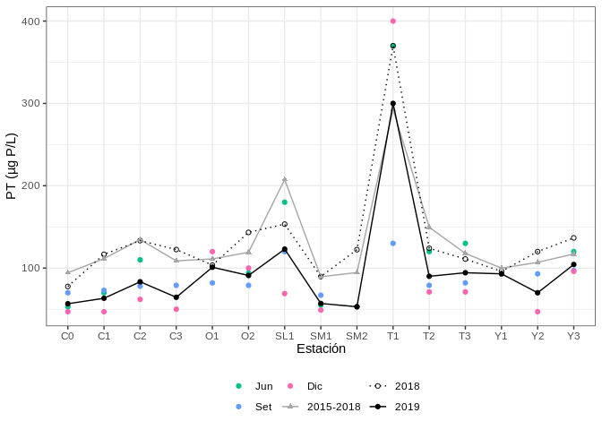

<!-- README.md is generated from README.Rmd.

NO TOCAR HASTA NO TENER EL PAQUETE INSTALADO Y ANDANDO ASÍ DEJO DE TENER
PROBLEMAS CON FUNCIONES QUE SUPUESTAMENTE NO ESTÁN (CRUZO LOS DEDOS)

Pendientes:

Instrucciones para instalar el paquete

Cambiar documentación de sia_datos_muestra_parametros: id_dato en vez de id.
Lo mismo para datos_sia

HACER PRUEBAS CON ESTE NUEVO 'datos_sia' y 'datos_sia_sed', con ejemplos, funciones, etc ....

Please edit that file -->

# manoSIAR

<!-- badges: start -->

<!-- badges: end -->

Este paquete contiene funciones y datos utilizados para trabajar con las
bases datos del SIA. De momento no es muy grande pero abarca tareas
diversas, tales como las que se usan en las aplicaciónes Shiny (vSIA,
hSIA e iSIA), o funciones para hacer gráficas que sirven para hacer
informes.

Tiene además un grupo no menor de tablas, incluyendo varias de la base
de datos INFAMBIENTALBD del SIA.

Para usar el paquete se recomienda el uso de
[tidyverse](https://www.tidyverse.org/) en general y muchos de los
paquetes necesarios son de ese conjunto. Los ejemplos mostrados aquí en
las distintas viñetas usan las funciones de `tidyverse` extensivamente.

## Instalación

El paquete se puede instalar desde GitHub (12/3/2021: no se ha puesto a
prueba aún):

``` r
# install.packages("devtools")
devtools::install_github("jumanbar/manoSIAR")
```

## Modo de uso

La idea es que el paquete trabaje en conjunto con la aplicación
[iSIA](). En la práctica, el flujo puede tomar dos caminos:

1.  Se puede trabajar con datos extraidos de la aplicación [iSiA]() en
    el momento.

2.  Se pueden usar datos que ya están en el paquete para analizar o
    hacer pruebas. El código así generado luego se puede utilizar para
    datos descargados desde [iSIA]().

Uno de los objetivos más importantes es que las herramientas del paquete
sirvan para elaborar **informes automatizados**, mediante Rmarkdown. Hay
un ejemplo (en construcción) con datos del programa Laguna Merín para
tomar de referencia:

``` r
# Tres formatos de salda posibles: PDF, HTML y DOC
demo('informe-laguna-merin-pdf',  'manoSIAR')
demo('informe-laguna-merin-html', 'manoSIAR')
demo('informe-laguna-merin-doc',  'manoSIAR')
```

### Algunos ejemplos simples

``` r
library(tidyverse)
library(manoSIAR)

# Cálculo de una media geométrica con valores aleatorios:
x <- rnorm(100, 5)
media_geom(x)
#> [1] 4.945037

# Uso de tsummary para resumir datos, usando el conjunto de datos iris:
iris %>% tsummary(Sepal.Length)
#>     n Min 1er Cu Media Mediana 3er Cu Max
#> 1 150 4.3    5.1 5.843     5.8    6.4 7.9

# Lo mismo, pero agrupando por especies:
iris %>% group_by(Species) %>% tsummary(Sepal.Length)
#> # A tibble: 3 x 8
#>   Species        n   Min `1er Cu` Media Mediana `3er Cu`   Max
#>   <fct>      <int> <dbl>    <dbl> <dbl>   <dbl>    <dbl> <dbl>
#> 1 setosa        50   4.3     4.8   5.01     5        5.2   5.8
#> 2 versicolor    50   4.9     5.6   5.94     5.9      6.3   7  
#> 3 virginica     50   4.9     6.22  6.59     6.5      6.9   7.9

# Cálculo de la raíz enésima:
tibble(x = c(4, -4, 4, -4), n = c(2, 2, 3, 3)) %>%
  mutate(raiz(x, n), x ^ (1 / n), abs(x) ^ (1 / n))
#> # A tibble: 4 x 5
#>       x     n `raiz(x, n)` `x^(1/n)` `abs(x)^(1/n)`
#>   <dbl> <dbl>        <dbl>     <dbl>          <dbl>
#> 1     4     2         2         2              2   
#> 2    -4     2       NaN       NaN              2   
#> 3     4     3         1.59      1.59           1.59
#> 4    -4     3        -1.59    NaN              1.59
```

#### Con extracciones de iSIA

El siguiente es un ejemplo que usa datos extraídos de iSIA (formato
‘largo’):

  - Programa: Laguna Merín
  - Año de las muestras: 2019
  - Matriz: Aguas superficiales
  - Muestras: superficie
  - Parámetros: ClorofilaA, NAmoniacal, NO2, NO3, NT, OD, pH, PO4, PT,
    SatO2 y T

Cargar los datos en la sesión, bajo el nombre `d` (asume que el archivo
se encuentra en el directorio de trabajo):

``` r
d <- readRDS('extraccion_20210213.rds')
```

Crear un gráfico de IET para las muestras tomadas en todas las
estaciones contenidas en el conjunto de datos (usando las funciones
`iet_tabla` (la cual internamente usa otra función, `iet`) y `g_iet` del
paquete):

``` r
# Gráfico del IET:
d %>% iet_tabla() %>% g_iet()
```



Cálculo del Amoníaco Libre, usando la función `amoniaco_libre_add`:

``` r
# Agregar NH3L:
d <- amoniaco_libre_add(d)

# Se pueden ver algunos valores aquí:
d %>%
  filter(id_parametro == 2091) %>%
  select(codigo_pto, fecha_muestra, param, valor)
#> # A tibble: 39 x 4
#>    codigo_pto fecha_muestra param  valor
#>    <fct>      <date>        <chr>  <dbl>
#>  1 C0         2019-06-04    NH3L  0.0687
#>  2 C1         2019-06-04    NH3L  0.0921
#>  3 C2         2019-06-04    NH3L  0.283 
#>  4 O2         2019-06-04    NH3L  0.187 
#>  5 SL1        2019-06-03    NH3L  0.135 
#>  6 SM1        2019-06-03    NH3L  0.0510
#>  7 SM2        2019-06-03    NH3L  0.0376
#>  8 T1         2019-06-05    NH3L  0.902 
#>  9 T2         2019-06-05    NH3L  0.133 
#> 10 T3         2019-06-06    NH3L  0.278 
#> # … with 29 more rows

# Gráficos de nutrientes:
g_mes_pto_all(d, id_parametro = c(2098, 2101, 2099, 2097, 2102, 2091), ncol = 3)
```



Las etiquetas del gráfico se pueden mejorar aún con la función
`t_eti_add` (ver viñeta ‘gráficos’).

El paquete cuenta con otras funciones listas para crear gráficos de
informes: ver `?g_mes_pto` o `?g_long` para más ejemplos, pero se
recomienda especialmente leer la viñeta ‘graficos’.

#### Con datos incluidos en el paquete

El paquete viene con dos conjuntos de datos extraídos del SIA: ver
`?datos_sia` o `?datos_sia_sed` para acceder a la documentación de estas
tablas, con datos de aguas superficiales y de sedimentos,
respectivamente.

Dichas tablas tienen todos los datos encontrados en SIA, a la fecha en
que fueron extraidos, para todos los programas y parámetros disponibles.
El objetivo de estas tablas es el de hacer pruebas, ejemplos y código
que luego se puede aplicar a datos más actualizados (extraídos con
iSIA).

Dado que se trata de tablas de gran tamaño (`datos_sia` tiene 223112
filas y 39 columnas), es conveniente filtrarlos según el subconjunto de
interés. Para esto es que el paquete cuenta con la función
`filtrar_datos`, que cumple la misma función que los filtros presentes
en la aplicación iSIA.

El siguiente es un ejemplo datos similares al ejemplo usados
anteriormente (la diferencia es el rango de fechas):

``` r
d <- filtrar_datos(datos_sia, id_programa = 10L, id_matriz = 6L,
                   rango_fechas = c('2015-01-01', '2019-12-31'),
                   tipo_punto_id = 1L,
                   id_parametro = c(2098, 2101, 2099, 2097, 2102, 2032,
                                    2018, 2090, 2021, 2017))
#> Warning in filtrar_datos(datos_sia, id_programa = 10L, id_matriz = 6L,
#> rango_fechas = c("2015-01-01", : id_estacion no especificado, se seleccionan por
#> defecto las estaciones correspondientes al programa seleccionado (id_programa =
#> 10)
#> Warning in filtrar_datos(datos_sia, id_programa = 10L, id_matriz = 6L, rango_fechas = c("2015-01-01", : orden_est no especificado. Se usa orden ',
#>             'alfabético & numérico: C0, C1, C2, C3, O1, O2, SL1, SM1, SM2, T1, T2, T3, Y1, Y2 y Y3

g_long(d, 2098, anio = 2019)
#> Warning in eti(id_parametro): Argumento t_eti faltante: se usa la tabla base
#> (ver ?t_eti_base)
```


### Formatos largo y ancho

La tabla de ejemplo, extraida desde [iSIA](), tiene formato ‘largo’, es
decir que los valores numéricos están todos en una única columna
(`valor`), mientras que los distintos parámetros están indicados en
otras columnas (ver `?datos_sia`). Entre otras cosas, este formato
implica que hay varias filas para una misma muestra.

``` r
d <- filter(d, anio == 2019)
# Algunos valores contenidos en los datos de ejemplo
select(d, id_muestra, id_parametro, nombre_clave, param, valor,
       LD = limite_deteccion, LC = limite_cuantificacion)
#> # A tibble: 390 x 7
#>    id_muestra id_parametro nombre_clave param  valor LD       LC      
#>         <dbl>        <int> <chr>        <chr>  <dbl> <chr>    <chr>   
#>  1    3293629         2090 NAmoniacal   NH4    0.021 "0.004"  "0.013" 
#>  2    3293629         2098 PT           PT    53     "15.000" "46.000"
#>  3    3293629         2097 PO4          PO4    9     "3.600"  "18.000"
#>  4    3293629         2099 NO3          NO3    0.04  "0.020"  "0.060" 
#>  5    3293629         2101 NO2          NO2    0.002 "0.002"  "0.005" 
#>  6    3293629         2102 NT           NT     0.45  "0.080"  "0.210" 
#>  7    3293629         2017 OD           OD     9.94  ""       ""      
#>  8    3293629         2018 pH           pH     7.16  ""       ""      
#>  9    3293629         2021 SatO2        SatO  93.8   ""       ""      
#> 10    3293629         2032 T            Tem   12.6   ""       ""      
#> # … with 380 more rows
```

> Nota: param es una columna agregada, no pertenece a las tablas
> originales del SIA. Ver `?datos_sia`

> Nota 2: en el ejemplo se renombraron las columnas limite\_deteccion y
> limite\_cuantificacion como LD y LC, respectivamente, para limitar el
> ancho del texto.

La cantidad de filas por muestra, `n`, equivale número de parámetros por
muestra (cada muestra se corresponde a un punto de muestreo y una
fecha):

``` r
count(d, id_muestra, codigo_pto, fecha_muestra)
#> # A tibble: 39 x 4
#>    id_muestra codigo_pto fecha_muestra     n
#>         <dbl> <fct>      <date>        <int>
#>  1    3293629 C0         2019-06-04       10
#>  2    3293630 C1         2019-06-04       10
#>  3    3293631 C2         2019-06-04       10
#>  4    3293634 O2         2019-06-04       10
#>  5    3293635 SL1        2019-06-03       10
#>  6    3293636 SM1        2019-06-03       10
#>  7    3293637 SM2        2019-06-03       10
#>  8    3293638 T1         2019-06-05       10
#>  9    3293639 T2         2019-06-05       10
#> 10    3293640 T3         2019-06-06       10
#> # … with 29 more rows
```

#### Ventajas

(del formato ‘largo’)

  - Es más fácil agrupar datos para calcular promedios, IET, etc, según
    otras columnas contenidas en los datos. Esto es especialmente cierto
    cuando se usan funciones del `tidyverse` (y más especialmente con el
    paquete `dplyr`). Ejemplos:

<!-- end list -->

``` r
d %>%
  group_by(param) %>%
  summarise(Promedio = mean(valor), Mediana = median(valor), Var = var(valor))
#> # A tibble: 10 x 4
#>    param  Promedio Mediana         Var
#>    <chr>     <dbl>   <dbl>       <dbl>
#>  1 NH4     0.111    0.067     0.0309  
#>  2 NO2     0.00621  0.0035    0.000189
#>  3 NO3     0.235    0.087     0.100   
#>  4 NT      1.13     0.96      0.385   
#>  5 OD      7.84     8.05      2.19    
#>  6 pH      6.82     6.87      0.286   
#>  7 PO4    63.8     50      6018.      
#>  8 PT    100.      79      5346.      
#>  9 SatO   83.3     84       193.      
#> 10 Tem    18.7     16.4      27.2

d %>% count(codigo_pto, param)
#> # A tibble: 150 x 3
#>    codigo_pto param     n
#>    <fct>      <chr> <int>
#>  1 C0         NH4       3
#>  2 C0         NO2       3
#>  3 C0         NO3       3
#>  4 C0         NT        3
#>  5 C0         OD        3
#>  6 C0         pH        3
#>  7 C0         PO4       3
#>  8 C0         PT        3
#>  9 C0         SatO      3
#> 10 C0         Tem       3
#> # … with 140 more rows
```

  - Funciona mejor con las herramientas de `ggplot2`. Por ejemplo:

<!-- end list -->

``` r
d %>%
  filter(id_parametro == 2032) %>%
  ggplot() +
  aes(codigo_pto, valor, color = as.factor(mes)) +
  geom_point() +
  scale_y_log10() +
  ylab("Temperatura (ºC)")
```


#### Desventajas

  - Es más complicado realizar cálculos que involucran varios datos de
    la misma muestra, como es el caso del Amoníaco Libre (razón por la
    que existe `amoniaco_libre_add`)

  - También es más complicado realizar gráficos de dispersión entre
    diferentes parámetros (razón por la cual existe la función `ancho`;
    ver a continuación)

#### La función `ancho`

Es posible reconfigurar estas tablas con la función `ancho`, que es un
[wrapper](https://en.wikipedia.org/wiki/Wrapper_function) de
[`pivot_wider`](https://tidyr.tidyverse.org/reference/pivot_wider.html)
(que a su vez es una versión más moderna de `reshape`), de forma que los
valores se reparten en distintas columnas, nombradas según sus
parámetros correspondientes. Esto es útil en muchas instancias, como
por ejemplo, hacer gráficos de dispersión entre diferentes variables:

``` r
da <- ancho(d)
#> Warning in ancho(d): Se eliminan automáticamente las columnas: parametro,
#> id_tipo_dato, grupo y codigo_nuevo
# La nueva tabla tiene columnas diferenciadas por parámetros y sus
# correspondientes límites de detección y cuantificación:
names(da)[27:ncol(da)]
#>  [1] "NH4"     "NH4_LD"  "NH4_LC"  "PT"      "PT_LD"   "PT_LC"   "PO4"    
#>  [8] "PO4_LD"  "PO4_LC"  "NO3"     "NO3_LD"  "NO3_LC"  "NO2"     "NO2_LD" 
#> [15] "NO2_LC"  "NT"      "NT_LD"   "NT_LC"   "OD"      "OD_LD"   "OD_LC"  
#> [22] "pH"      "pH_LD"   "pH_LC"   "SatO"    "SatO_LD" "SatO_LC" "Tem"    
#> [29] "Tem_LD"  "Tem_LC"

# Un gráfico de dispersión clásico se puede crear así:
plot(SatO ~ OD, data = da)
```


También facilita, como se anunciaba anteriormente, ciertos cálculos:

``` r
amoniaco_libre(da$NH4, da$pH, da$Tem)
#>  [1] 0.068720746 0.092142796 0.283106162 0.186621605 0.134875992 0.051001092
#>  [7] 0.037590222 0.901526111 0.132840832 0.278394904 1.588726074 0.034479196
#> [13] 0.037976825 0.027382422 0.149163328 0.008191471 0.247087381 0.583987330
#> [19] 0.313959071 0.609317560 0.053257353 0.010361191 0.078000184 0.048402793
#> [25] 0.035234671 0.105389784 0.308343265 0.223506836 0.398845901 0.410079857
#> [31] 1.563079006 0.605243094 0.459305380 9.052966117 0.130373590 0.017302355
#> [37] 2.042498721 0.559967792 0.491684073
```

Como es de esperar, en este caso cada muestra ocupa una única fila, y la
tabla es mucho más ancha de lo que era:

``` r
count(da, id_muestra, codigo_pto, fecha_muestra)
#> # A tibble: 39 x 4
#>    id_muestra codigo_pto fecha_muestra     n
#>         <dbl> <fct>      <date>        <int>
#>  1    3293629 C0         2019-06-04        1
#>  2    3293630 C1         2019-06-04        1
#>  3    3293631 C2         2019-06-04        1
#>  4    3293634 O2         2019-06-04        1
#>  5    3293635 SL1        2019-06-03        1
#>  6    3293636 SM1        2019-06-03        1
#>  7    3293637 SM2        2019-06-03        1
#>  8    3293638 T1         2019-06-05        1
#>  9    3293639 T2         2019-06-05        1
#> 10    3293640 T3         2019-06-06        1
#> # … with 29 more rows
dim(d)
#> [1] 390  39
dim(da)
#> [1] 39 56
```

## Tablas de infambientalbd (base de datos)

Infambientalbd es la base de datos en donde se almacena mucha
información concerniente al SIA, especialmente la de monitoreos de
aguas y sedimentos, incluyendo lo relativo a los programas de monitoreo
(estaciones, cuencas, etc), parámetros (nombres, unidades de medida
según matriz, etc.). *No incluye* datos de aire.

Este paquete cuenta con copias de muchas de las tablas contenidas en
esta base de datos, en
[clase](https://bookdown.org/jboscomendoza/r-principiantes4/tipos-de-datos.html)
[**data.frame**](https://bookdown.org/jboscomendoza/r-principiantes4/data-frames.html)
(en verdad, usa una variante más moderna:
[tibble](https://r4ds.had.co.nz/tibbles.html)).

Todas las tablas traídas de infambiental se nombran combinando el
prefijo *sia\_* con el nombre original. Ejemplo: la tabla
`sia_parametro` contiene la misma información que la tabla `parametro`
de infambientalbd.

Como se estila en bases de datos, estas tablas generalmente hay una
columna dedicada a un “id”: un indentificador numérico que es único para
cada entrada, la cual generalmente se llama `id_[..nombre..]` o
simplemente `id`. Por ejemplo, en la tabla `sia_parametro`, la columna
`id_parametro` identifica a cada parámetro con un número entero
positivo. El rol de los identificadores es evitar ambigüedades. Por
ejemplo, podemos usar el `id_parametro` para asegurarnos de que
trabajamos con el parámetro que nos interesa; en el caso del Fósforo
Total, el `id_parametro` es 2098:

<!-- ```{r sia_parametro} -->

``` r
filter(sia_parametro, id_parametro == 2098)
#> # A tibble: 1 x 7
#>   id_parametro parametro enumerado nombre_clave decimales par_vigente
#>          <int> <chr>     <lgl>     <chr>            <int> <lgl>      
#> 1         2098 Fósforo … FALSE     PT                   9 TRUE       
#> # … with 1 more variable: codigo_airviro <chr>
```

Otra característica importante es que ante un eventual cambio en el
nombre de los parámetros (columnas `nombre_clave` y/o `parametro`), los
`id` no van a cambiar, evitando confusiones.

> **NOTA**: En general, al exportar datos desde infambientalbd (i.e.:
> muestras con valores de parámetros), la regla que uso es usar nombres
> de `id` descriptivos, para las tablas principales (programas,
> estaciones, parámetros, etc). Entonces, si bien originalmente hay una
> columna `id` en la tabla `estacion`, al momento de la importación se
> ha renombrado como `id_estacion`. Esto aplica tanto para iSIA como
> para la mayoría de los datos contenidos en este paquete. De todas
> formas hay algunas tablas que mantienen los nombres originales.

Las tablas más importantes son:

  - `datos_sia`: datos de matriz Aguas superficiales y `datos_sia_sed`
    de Sedimentos, extraidos el 2020-11-04. Esta tabla no está en
    infambientalbd, sino que es una tabla construida a partir de las
    existentes en esa base de datos.

  - `sia_estacion`: datos de las estaciones de monitoreo.

  - `sia_param_unidad`: tabla que relaciona `id` de parámetros con `id`
    de las unidades de medida (presentes en `sia_unidad`).

  - `sia_unidad`: tabla con las unidades de medida usadas en el SIA.

  - `sia_programa`: tabla con los programas de monitoreo del SIA.

Por más detalles de estas tablas, ver la viñeta ‘datos incluidos’

### Buscadores de ID

El paquete incluye buscadores de id para las varias tablas importadas
del SIA, usando un texto (i.e.: un Google de ids). El texto o patrón
puede ser una expresión regular (la cual se pasa internamente a
[`agrepl`](https://www.rdocumentation.org/packages/base/versions/3.6.2/topics/agrep)).

Un par de ejemplos
simples:

``` r
# Búsqueda del id del parámetro de interés (Fósforo Total) por aproximación:
par_id("fosforo")
#> # A tibble: 1 x 7
#>   id_parametro parametro enumerado nombre_clave decimales par_vigente
#>          <int> <chr>     <lgl>     <chr>            <int> <lgl>      
#> 1         2098 Fósforo … FALSE     PT                   9 TRUE       
#> # … with 1 more variable: codigo_airviro <chr>

# Búsqueda del id de una estación en particular:
est_id('olimar')
#> # A tibble: 3 x 17
#>   codigo_pto estacion latitud longitud   gid id_playa prog_monitoreo     id
#>   <chr>      <chr>      <dbl>    <dbl> <int>    <int>          <int>  <int>
#> 1 O2         "R\\u00…   -33.3    -53.9     0       NA             10 100290
#> 2 O1         "R\\u00…   -33.3    -54.4     0       NA             10 100291
#> 3 C2         "R\\u00…   -33.2    -53.8     0       NA             10 100293
#> # … with 9 more variables: version <int>, tipo_punto_id <int>,
#> #   estacion_asociada_id <int>, departamento <int>, sub_cuenca <int>,
#> #   orden_ingreso <int>, ingreso_interno <lgl>, matriz_estacion <int>,
#> #   estacion_activa <lgl>
```

  - `pro_id`: Busca programas en sia\_programa en base al campo
    nombre\_programa de dicha tabla.

  - `est_id`: Busca estaciones en sia\_estacion en base a los campos
    codigo\_pto y estacion de dicha tabla.

  - `mat_id`: Busca matrices en sia\_matriz en base al campo nombre de
    dicha tabla.

  - `uni_id`: Busca unidades en sia\_unidad en base al campo uni\_nombre
    de dicha tabla.

  - `ins_id`: Busca instituciones en sia\_institucion en base al campo
    nombre de dicha tabla.

  - `dep_id`: Busca departamentos en sia\_departamento en base al campo
    dep\_nombre de dicha tabla.

<!--
## Installation

You can install the released version of manoSIAR from [CRAN](https://CRAN.R-project.org) with:

``` r
install.packages("manoSIAR")
```

El paquete se puede descargar desde [GitHub](https://github.com/) mediante los comandos:

``` r
# install.packages("devtools")
devtools::install_github("jumanbar/manoSIAR")
```
-->

## Funciones (cálculos)

### Índice de estado trófico (IET)

La función `iet` calcula el IET para valores de Fósforo Total (en
microgramos por litro):

``` r
library(manoSIAR)
iet(c(25, 50, 75, 250))
#> [1] 50.65856 54.25856 56.36443 62.61750
PT <- seq(0, 300, by=5)
plot(PT, iet(PT), ylab = "IET", xlab = "PT (ug/L)", pch = 20)
```


### Tabla con categorías de IET

Agrupa valores de IET por estación de monitoreo (`codigo_pto`),
asignando categorías a los valores según su IET (Oligotrófico,
Mesotrófico, etc…). Usa la media geométrica para agrupar los valores
encontrados.

``` r
d <- filtrar_datos(datos_sia, id_programa = 10L, id_matriz = 6L,
                   rango_fechas = c('2019-01-01', '2019-12-31'),
                   tipo_punto_id = 1L,
                   id_parametro = 2098)
#> Warning in filtrar_datos(datos_sia, id_programa = 10L, id_matriz = 6L,
#> rango_fechas = c("2019-01-01", : id_estacion no especificado, se seleccionan por
#> defecto las estaciones correspondientes al programa seleccionado (id_programa =
#> 10)
#> Warning in filtrar_datos(datos_sia, id_programa = 10L, id_matriz = 6L, rango_fechas = c("2019-01-01", : orden_est no especificado. Se usa orden ',
#>             'alfabético & numérico: C0, C1, C2, C3, O1, O2, SL1, SM1, SM2, T1, T2, T3, Y1, Y2 y Y3
iet_tabla(d)
#> # A tibble: 15 x 3
#>    codigo_pto   IET categ      
#>    <fct>      <dbl> <chr>      
#>  1 C0          54.8 Mesotrófico
#>  2 C1          55.4 Mesotrófico
#>  3 C2          56.8 Mesotrófico
#>  4 C3          55.4 Mesotrófico
#>  5 O1          57.8 Mesotrófico
#>  6 O2          57.3 Mesotrófico
#>  7 SL1         58.5 Mesotrófico
#>  8 SM1         54.9 Mesotrófico
#>  9 SM2         54.6 Mesotrófico
#> 10 T1          63   Eutrófico  
#> 11 T2          57.2 Mesotrófico
#> 12 T3          57.4 Mesotrófico
#> 13 Y1          57.5 Mesotrófico
#> 14 Y2          55.7 Mesotrófico
#> 15 Y3          58.1 Mesotrófico
```

La función puede, además, agrupar por otras columnas, como por ejemplo,
mes, año, etc…

``` r
d <- filtrar_datos(datos_sia, id_programa = 10L, id_matriz = 6L,
                   rango_fechas = c('2017-01-01', '2019-12-31'),
                   tipo_punto_id = 1L,
                   id_parametro = 2098)
#> Warning in filtrar_datos(datos_sia, id_programa = 10L, id_matriz = 6L,
#> rango_fechas = c("2017-01-01", : id_estacion no especificado, se seleccionan por
#> defecto las estaciones correspondientes al programa seleccionado (id_programa =
#> 10)
#> Warning in filtrar_datos(datos_sia, id_programa = 10L, id_matriz = 6L, rango_fechas = c("2017-01-01", : orden_est no especificado. Se usa orden ',
#>             'alfabético & numérico: C0, C1, C2, C3, O1, O2, SL1, SM1, SM2, T1, T2, T3, Y1, Y2 y Y3
iet_tabla(d, mes)
#> # A tibble: 58 x 4
#>    codigo_pto   mes   IET categ      
#>    <fct>      <int> <dbl> <chr>      
#>  1 C0             3  56.4 Mesotrófico
#>  2 C0             6  55.6 Mesotrófico
#>  3 C0             9  55.8 Mesotrófico
#>  4 C0            12  56.1 Mesotrófico
#>  5 C1             3  58.6 Mesotrófico
#>  6 C1             6  56.8 Mesotrófico
#>  7 C1             9  57   Mesotrófico
#>  8 C1            12  57.9 Mesotrófico
#>  9 C2             3  59.6 Eutrófico  
#> 10 C2             6  58.2 Mesotrófico
#> # … with 48 more rows
iet_tabla(d, anio, mes)
#> # A tibble: 136 x 5
#>    codigo_pto  anio   mes   IET categ      
#>    <fct>      <int> <int> <dbl> <chr>      
#>  1 C0          2017     3  57.1 Mesotrófico
#>  2 C0          2017     6  56.6 Mesotrófico
#>  3 C0          2017     9  55.6 Mesotrófico
#>  4 C0          2017    12  56.6 Mesotrófico
#>  5 C0          2018     3  55.7 Mesotrófico
#>  6 C0          2018     6  55.8 Mesotrófico
#>  7 C0          2018    12  57.9 Mesotrófico
#>  8 C0          2019     6  54.6 Mesotrófico
#>  9 C0          2019     9  56   Mesotrófico
#> 10 C0          2019    12  53.9 Mesotrófico
#> # … with 126 more rows

# Esta función se puede combinar con herramientas de dplyr fácilmente:
iet_tabla(d, anio) %>%
  group_by(anio) %>%
  summarise(n = sum(!is.na(IET)), IET = mean(IET, na.rm = TRUE))
#> # A tibble: 3 x 3
#>    anio     n   IET
#>   <int> <int> <dbl>
#> 1  2017    14  58.4
#> 2  2018    15  58.9
#> 3  2019    15  57.0
```

-----

## Para desearrolladores

> (Sección que, al menos en parte, escribo para refrescar mi propia
> memoria.)

Este paquete se creó siguiendo de forma aproximada los consejos del
libro [R Packages](https://r-pkgs.org/index.html) de Hadley Wickham. El
libro entero es importante para entender el desarrollo de paquetes (o la
documentación original de CRAN), pero para referencia rápida de quien ya
sabe la teoría y sólo tiene que recordar el flujo, ir directamente al
capítulo 5: [Fundamental development
workflows](https://r-pkgs.org/workflows101.html).

Algunas notas:

  - Al usar funciones de paquetes externos, evitar `require` o
    `library`; usar en cambio los operadores `::` o `:::`. Ejemplo:
    `dplyr::filter`. Eso evita afectar el ambiente de trabajo del
    usuario final. En este paquete las excepciones son `ggplot2` y
    `%>%`, ya que de otra forma el código se vuelve muy engorroso
    rápidamente.

  - La función `devtools::load_all()` (Ctrl+Shift+L) sirve para “cargar”
    el paquete en la sesión, incluyendo funciones, viñetas, y otros
    códigos. Conviene correrlo cada vez que cambiamos alguna función y
    queremos probarla, por ejemplo.

  - La función `devtools::document()` (Ctrl+Shift+D) sirve para
    actualizar los archivos de documentación.
